# 🏗️ Kiến trúc Hệ thống Ada FastFood

## 📋 Tổng quan Kiến trúc

Ada FastFood sử dụng kiến trúc **3-tier đơn giản** với sự phân tách rõ ràng giữa Frontend, Backend và Database. Đây là kiến trúc monolithic phù hợp cho việc học tập và phát triển dự án nhỏ.

## 🎯 Nguyên tắc Thiết kế

### 🔧 **Đơn giản (Simplicity)**
- Kiến trúc dễ hiểu và maintain
- Công nghệ phổ biến và stable
- Setup và deployment đơn giản

### 🔄 **Phân tách rõ ràng (Separation of Concerns)**
- Frontend chỉ xử lý UI/UX
- Backend xử lý business logic
- Database lưu trữ dữ liệu

### 📚 **Học tập (Learning-Oriented)**
- Tập trung vào core concepts
- Dễ debug và troubleshoot
- Code structure rõ ràng

## 🏛️ Kiến trúc Tổng thể

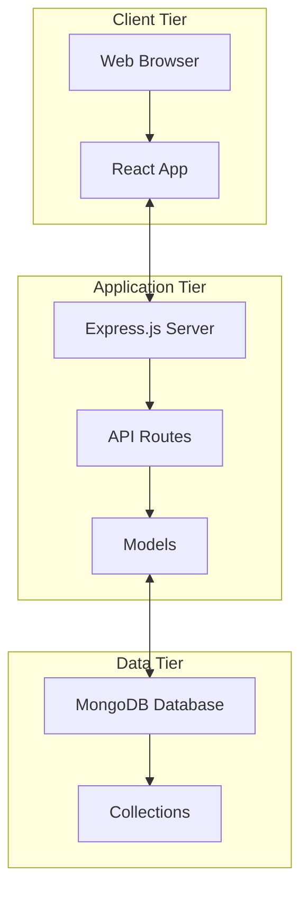

## 🎨 Frontend Architecture (React)

### 📁 **Cấu trúc Frontend**

```
frontend/src/
├── components/          # React Components
│   ├── App.jsx         # Main app component
│   ├── Header.jsx      # Navigation header
│   ├── Footer.jsx      # Footer component
│   └── admin/          # Admin-specific components
├── pages/              # Page-level components
│   ├── UserPage.jsx    # Customer homepage
│   ├── Login.jsx       # Login page
│   ├── Register.jsx    # Registration
│   ├── GioHang.jsx     # Shopping cart
│   └── admin/          # Admin pages
└── styles/             # CSS files
    ├── App.css
    ├── Header.css
    └── [component].css
```

### 🔄 **Component Flow**

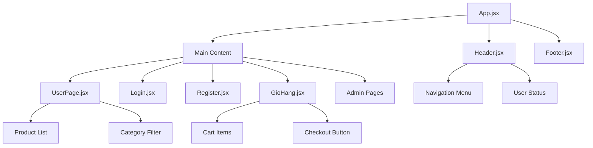

### ⚛️ **React Architecture**

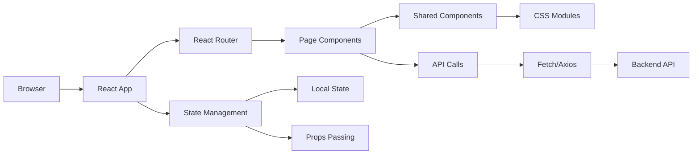

## 🚀 Backend Architecture (Express)

### 📁 **Cấu trúc Backend**

```
backend/src/
├── app.js              # Main server file
├── routes/             # API route handlers
│   ├── auth.js        # Authentication routes
│   ├── products.js    # Product management
│   ├── users.js       # User management
│   └── orders.js      # Order processing
├── models/             # MongoDB models
│   ├── User.js        # User schema
│   ├── Product.js     # Product schema
│   └── Order.js       # Order schema
├── middleware/         # Express middleware
│   ├── auth.js        # Authentication check
│   └── upload.js      # File upload handling
└── uploads/            # Static file storage
```

### 🔌 **API Architecture**

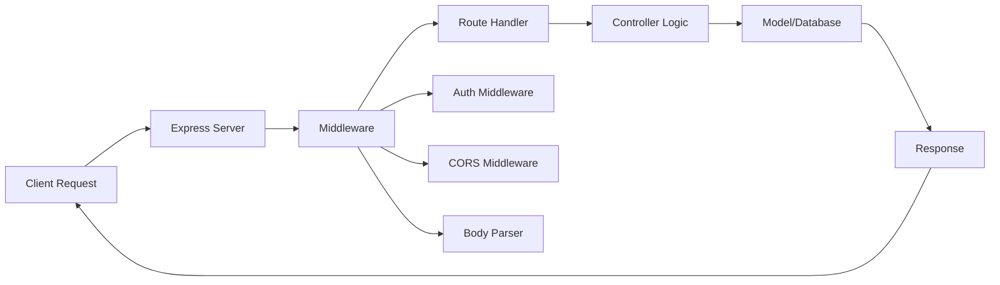

### 📡 **API Endpoints Structure**

```mermaid
graph TD
    A[/api] --> B[/auth]
    A --> C[/users]
    A --> D[/products]
    A --> E[/orders]
    
    B --> B1[POST /login]
    B --> B2[POST /register]
    B --> B3[POST /logout]
    
    C --> C1[GET /profile]
    C --> C2[PUT /profile]
    
    D --> D1[GET /]
    D --> D2[POST / (admin)]
    D --> D3[PUT /:id (admin)]
    D --> D4[DELETE /:id (admin)]
    
    E --> E1[GET / (user orders)]
    E --> E2[POST / (create order)]
    E --> E3[GET /all (admin)]
```

## 🗄️ Database Architecture (MongoDB)

### 📊 **Database Schema**

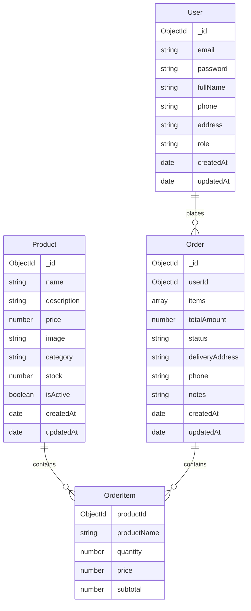

### 🔍 **Collections & Indexing**

```javascript
// Users Collection
db.users.createIndex({ "email": 1 }, { unique: true })
db.users.createIndex({ "role": 1 })

// Products Collection  
db.products.createIndex({ "name": "text", "description": "text" })
db.products.createIndex({ "category": 1, "isActive": 1 })
db.products.createIndex({ "price": 1 })

// Orders Collection
db.orders.createIndex({ "userId": 1, "createdAt": -1 })
db.orders.createIndex({ "status": 1 })
```

## 🔄 Data Flow Architecture

### 📊 **User Authentication Flow**

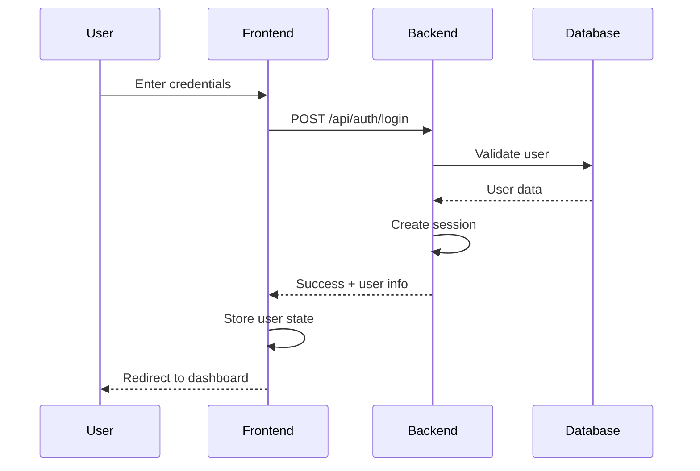

### 🛒 **Product Purchase Flow**

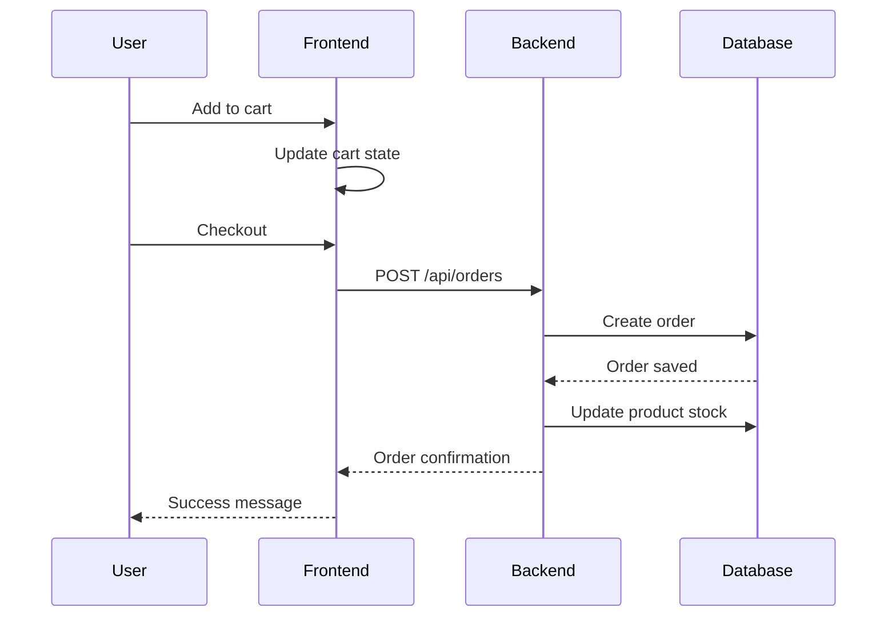

### 🔧 **Admin Management Flow**

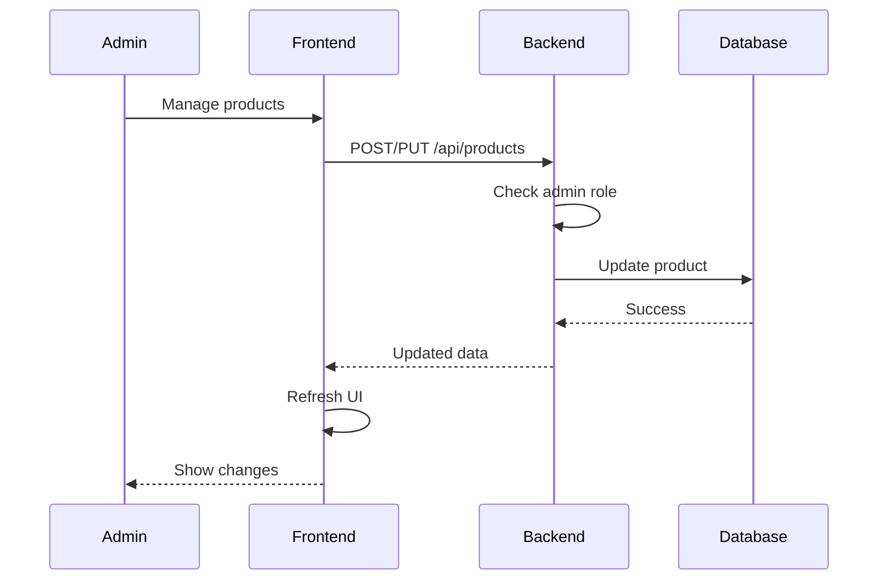

## 🔒 Security Architecture

### 🛡️ **Authentication & Authorization**

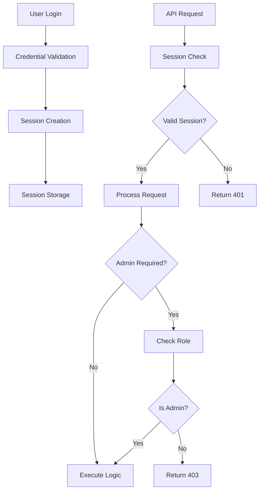

### 🔐 **Security Layers**

1. **Client-Side Security:**
   - Input validation
   - XSS prevention
   - Secure form handling

2. **Server-Side Security:**
   - Session management
   - Password hashing (bcrypt)
   - Role-based access control
   - File upload validation

3. **Database Security:**
   - MongoDB connection security
   - Data validation
   - Basic access control

## 📁 File Upload Architecture

### 📂 **File Storage Strategy**

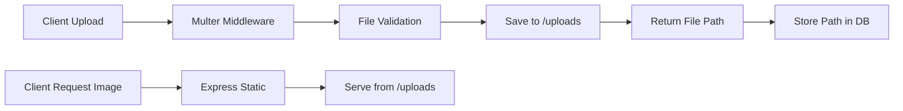

### 🖼️ **Image Handling**

```javascript
// File upload configuration
const storage = multer.diskStorage({
  destination: './uploads/',
  filename: (req, file, cb) => {
    cb(null, Date.now() + '-' + file.originalname)
  }
})

// File validation
const fileFilter = (req, file, cb) => {
  if (file.mimetype.startsWith('image/')) {
    cb(null, true)
  } else {
    cb(new Error('Only image files allowed'))
  }
}
```

## 🚀 Deployment Architecture

### 🏗️ **Development Setup**

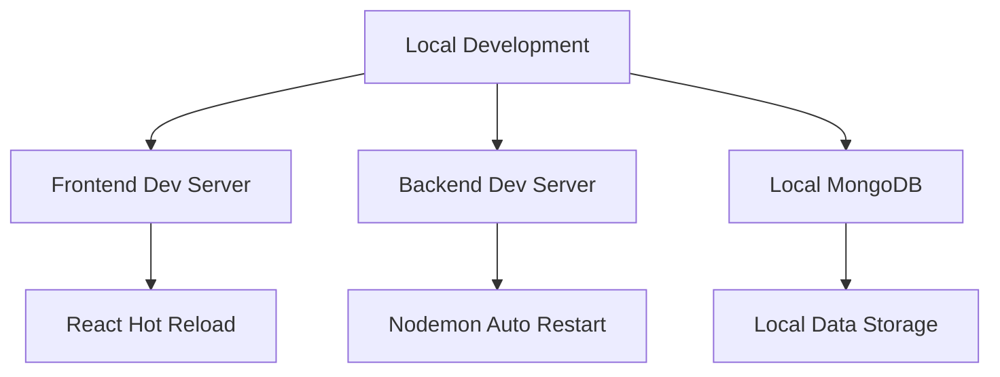

### 📦 **Production Deployment**

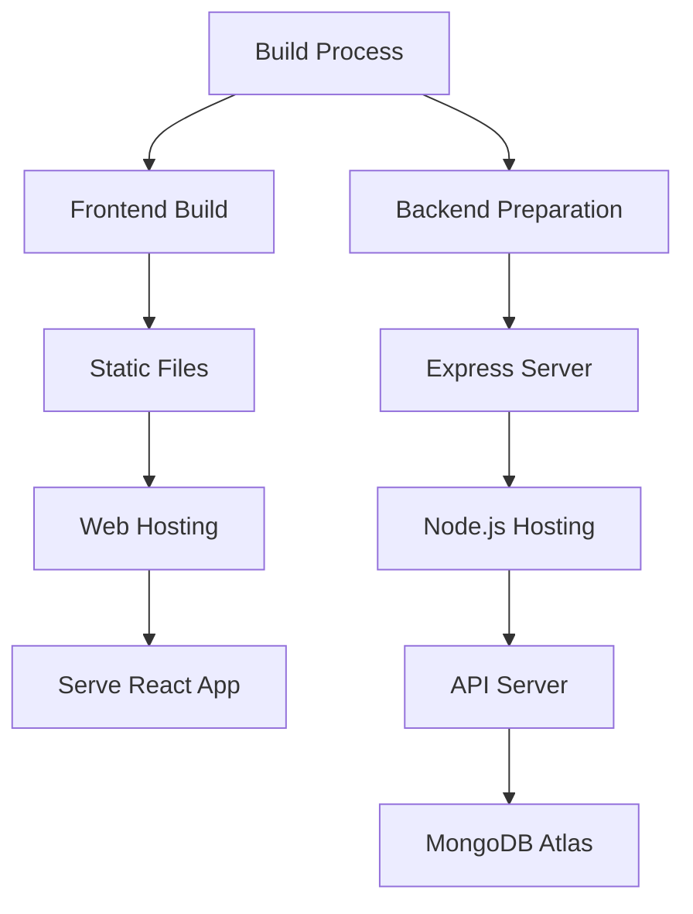

## 🔧 Technology Integration

### 📚 **Frontend Technologies**

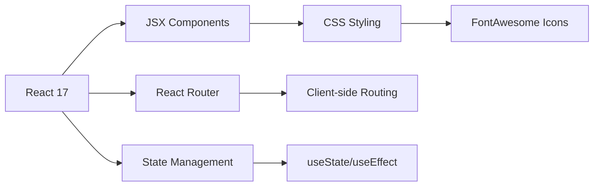

### 🚀 **Backend Technologies**

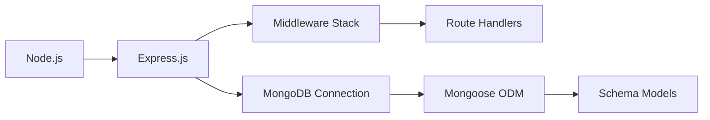

## 📈 Performance Considerations

### ⚡ **Frontend Performance**
- Component lazy loading (future)
- Image optimization
- CSS optimization
- Bundle size management

### 🚀 **Backend Performance**
- Database query optimization
- Connection pooling
- Response caching (future)
- Error handling optimization

### 🗄️ **Database Performance**
- Proper indexing
- Query optimization
- Connection management
- Data validation

## 🔄 Development Workflow

### 👨‍💻 **Development Process**

```mermaid
graph LR
    A[Code Changes] --> B[Local Testing]
    B --> C[Git Commit]
    C --> D[GitHub Push]
    D --> E[GitHub Actions]
    E --> F[Build & Test]
    F --> G[Deploy (Manual)]
```

### 🧪 **Testing Strategy**
- Manual testing
- Basic unit tests (future)
- Integration testing (future)
- User acceptance testing

---

**🏗️ Kiến trúc này được thiết kế đơn giản nhưng hiệu quả, phù hợp cho việc học tập và phát triển dự án nhỏ. Có thể mở rộng và cải tiến trong tương lai.**
