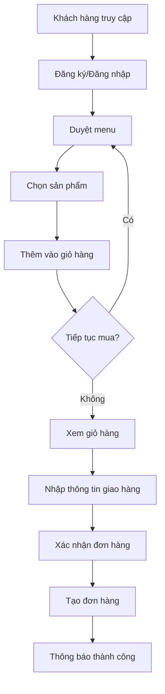
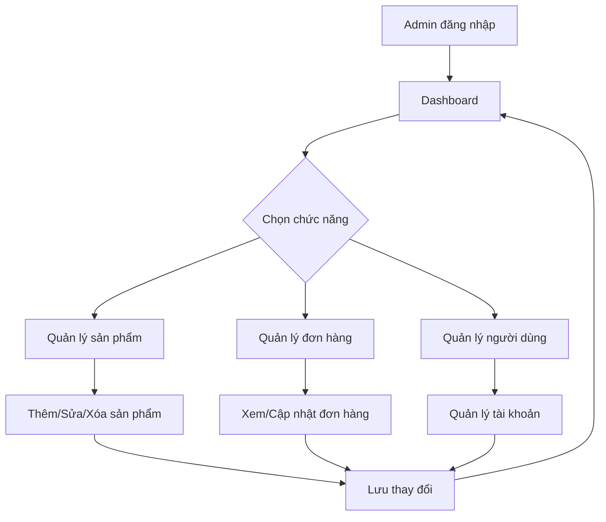

# 📋 Mô tả Hệ thống Ada FastFood

## 🏢 Tổng quan Dự án

**Ada FastFood** là ứng dụng web fullstack quản lý nhà hàng thức ăn nhanh, được phát triển bởi sinh viên ngành Công nghệ Phần mềm. Hệ thống được xây dựng với mục tiêu cung cấp nền tảng đặt món trực tuyến đơn giản và hiệu quả.

## 🎯 Mục tiêu Hệ thống

### Mục tiêu chính:
- 🍔 Tạo platform đặt đồ ăn online đơn giản
- 👥 Phân biệt rõ ràng vai trò khách hàng và admin
- 💻 Học tập và thực hành công nghệ web hiện đại
- 📱 Giao diện thân thiện, dễ sử dụng

### Mục tiêu học tập:
- React.js frontend development
- Node.js backend development  
- MongoDB database management
- GitHub workflow & CI/CD basics

## 👥 Phân tích Người dùng

### 🛍️ **Khách hàng (Customer)**
**Vai trò:** Người dùng cuối đặt đồ ăn

**Quyền hạn:**
- Xem danh sách sản phẩm
- Thêm sản phẩm vào giỏ hàng
- Đặt hàng online
- Quản lý thông tin cá nhân
- Xem lịch sử đơn hàng (cơ bản)

**Quy trình sử dụng:**
1. Đăng ký/Đăng nhập
2. Duyệt menu sản phẩm
3. Thêm món vào giỏ hàng
4. Đặt hàng
5. Theo dõi đơn hàng

### 🔧 **Quản trị viên (Admin)**
**Vai trò:** Người quản lý hệ thống

**Quyền hạn:**
- Quản lý sản phẩm (CRUD)
- Quản lý đơn hàng
- Quản lý người dùng
- Xem thống kê cơ bản
- Cập nhật trạng thái đơn hàng

**Quy trình quản lý:**
1. Đăng nhập admin
2. Quản lý danh mục sản phẩm
3. Xử lý đơn hàng
4. Quản lý người dùng

## 🔧 Tính năng Chính

### 🛍️ **Module Khách hàng**

#### 🔐 **Authentication**
- Đăng ký tài khoản mới
- Đăng nhập/Đăng xuất
- Quên mật khẩu (cơ bản)
- Quản lý profile

#### 🍕 **Quản lý Sản phẩm (View Only)**
- Xem danh sách món ăn
- Xem chi tiết sản phẩm
- Tìm kiếm sản phẩm (cơ bản)
- Phân loại theo danh mục

#### 🛒 **Giỏ hàng**
- Thêm sản phẩm vào giỏ
- Cập nhật số lượng
- Xóa sản phẩm khỏi giỏ
- Tính tổng tiền

#### 📱 **Đặt hàng**
- Tạo đơn hàng mới
- Nhập thông tin giao hàng
- Xác nhận đơn hàng
- Xem trạng thái đơn hàng

### 🔧 **Module Admin**

#### 📊 **Dashboard**
- Tổng quan hệ thống
- Số liệu thống kê cơ bản
- Quản lý nhanh

#### 🍔 **Quản lý Sản phẩm**
- Thêm sản phẩm mới
- Chỉnh sửa thông tin sản phẩm
- Xóa sản phẩm
- Upload hình ảnh sản phẩm
- Quản lý danh mục

#### 📋 **Quản lý Đơn hàng**
- Xem danh sách đơn hàng
- Cập nhật trạng thái đơn hàng
- Xem chi tiết đơn hàng
- Xuất báo cáo đơn hàng (cơ bản)

#### 👥 **Quản lý Người dùng**
- Xem danh sách người dùng
- Quản lý trạng thái tài khoản
- Phân quyền cơ bản

## 🔄 Quy trình Nghiệp vụ

### 🛍️ **Quy trình Đặt hàng**



### 🔧 **Quy trình Quản lý Admin**



## 🛠️ Công nghệ Sử dụng

### 🎨 **Frontend**
- **React 17:** Library UI chính
- **React Router:** Điều hướng trang
- **CSS3:** Styling và responsive
- **FontAwesome:** Icon library
- **JavaScript ES6+:** Ngôn ngữ lập trình

### 🚀 **Backend**
- **Node.js:** Runtime environment
- **Express.js:** Web framework
- **MongoDB:** NoSQL database
- **Mongoose:** ODM cho MongoDB
- **JavaScript:** Ngôn ngữ backend

### 🔧 **Development Tools**
- **Git:** Version control
- **GitHub:** Repository hosting
- **GitHub Actions:** CI/CD cơ bản
- **VS Code:** IDE
- **npm:** Package manager

## 📊 Cơ sở Dữ liệu

### 🗄️ **Collections chính**

#### 👤 **Users Collection**
```javascript
{
  _id: ObjectId,
  email: String,
  password: String (hashed),
  fullName: String,
  phone: String,
  address: String,
  role: String, // 'customer' | 'admin'
  createdAt: Date,
  updatedAt: Date
}
```

#### 🍔 **Products Collection**
```javascript
{
  _id: ObjectId,
  name: String,
  description: String,
  price: Number,
  image: String,
  category: String,
  stock: Number,
  isActive: Boolean,
  createdAt: Date,
  updatedAt: Date
}
```

#### 📦 **Orders Collection**
```javascript
{
  _id: ObjectId,
  userId: ObjectId,
  items: Array,
  totalAmount: Number,
  status: String,
  deliveryAddress: String,
  phone: String,
  notes: String,
  createdAt: Date,
  updatedAt: Date
}
```

## 🔒 Bảo mật

### 🛡️ **Biện pháp bảo mật cơ bản**
- Mã hóa mật khẩu với bcrypt
- Session-based authentication
- Input validation cơ bản
- CORS configuration
- File upload validation

## 📈 Phát triển Tương lai

### 🚀 **Tính năng có thể mở rộng**
- JWT authentication thay cho session
- Payment gateway integration
- Real-time notifications
- Mobile responsive optimization
- Advanced search & filter
- Rating & review system
- Email notifications
- Docker containerization

### 📊 **Cải tiến hiệu suất**
- Database indexing
- Image optimization
- Caching implementation
- API optimization
- Frontend optimization

## 🎓 Giá trị Học tập

### 📚 **Kỹ năng đạt được**
- Fullstack web development
- Database design & management
- API development
- Frontend/Backend integration
- Version control với Git
- Basic DevOps với GitHub Actions

### 💡 **Bài học kinh nghiệm**
- Project structure organization
- Code collaboration
- Bug fixing & debugging
- User experience design
- Basic project management

---

**📝 Tài liệu này mô tả hệ thống Ada FastFood ở mức độ cơ bản, phù hợp với mục tiêu học tập và phát triển kỹ năng của sinh viên.**
